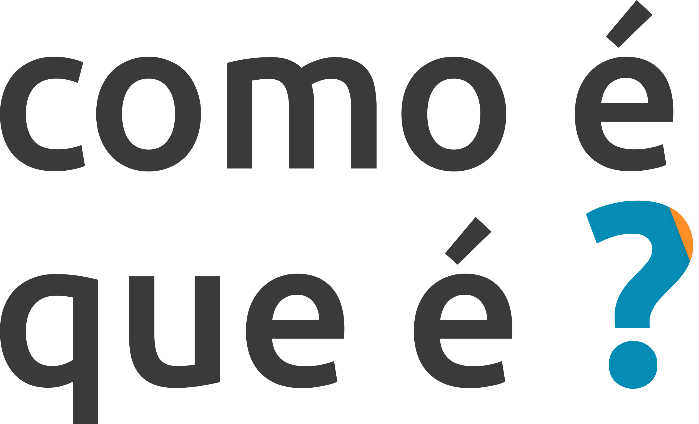

# 

Projeto da disciplina (IF977) Engenharia de Software, do curso de graduação em Sistemas de Informação do Centro de Informática da Universidade Federal de Pernambuco (UFPE).

## Descrição do Projeto

O *Como é que é?* é uma aplicação web que irá disponibilizar tutoriais para o aprendizado de ferramentas tecnológicas do cotidiano como WhatsApp, Instagram, Facebook, Twitter, Linkedin, Airbnb, Uber, Uber Eats, Ifood, Discord, Word, Power Point, Excel; Com foco em pessoas mais velhas. Os tutoriais serão disponibilizados com um passo-a-para utilização e terá um espaço disponível para discussão entre os usuários e também entre a equipe do sistema. O app tem o intuito de ajudar essas pessoas com mais dificuldades a entender as ferramentas tecnológicas e estarem mais imersas no contexto atual da sociedade.

## Justificativa do Projeto

A população de jovens diminui ano após ano em vários países. A idade avançada predomina como tendência no mundo. De acordo com estimativas de várias entidades de pesquisa, entre as décadas de 2050 e 2060 a população mundial será composta 30% de idosos.
A expectativa de vida mundial cresceu 5 anos entre 2000 e 2015, o maior crescimento desde os anos 60. A esperança de vida dos brasileiros subiu de 75,2 anos em 2014 para 76 anos em 2018.
Com isso, surgiu uma nova modalidade de mercado denominada de *Silver Economy*, que são produtos e serviços que atentem às mudanças que afetam as pessoas com mais de 50 anos.
Neste conexto em geral descrito, verificamos uma oportunidade de mercado, onde muitos adultos maduros precisam de uma nova linguagem de relacionamento e serviços de acordo com suas necessidades e valores, então visando auxiliar esse grupo é que elaboramos o nosso projeto, para que sem barreiras esses adultos possam participar ativamente da tecnologia, sem limitações, e de uma vida integrada em uma sociedade altamente conectada.

## Equipe

- [Almir Gabriel](https://github.com/almirgabrielgds) (Desenvolvedor e Tester)
- [Emerson Victor](https://github.com/EmersonVictor) (Scrum Master e Desenvolvedor)
- [José Neto](https://github.com/jcsn2) (Product Owner e Desenvolvedor)
- [José Tomáz](https://github.com/jtomaz99) (Desenvolvedor e Tester)
- [Navarro Guimarães](https://github.com/NavarroGuimaraes) (Desenvolvedor e Tester)
